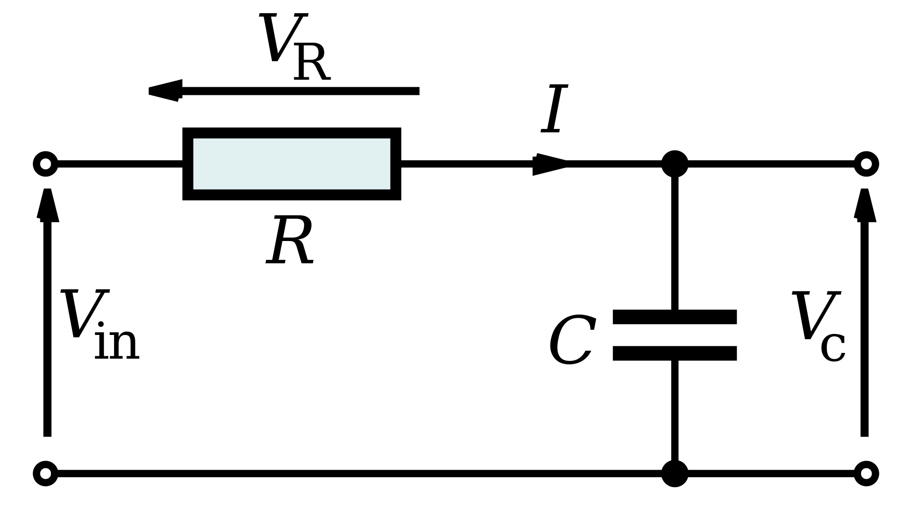

In this paper, I will explain my intuitions that led to the `RC1' and `RC2' models. Contrary to what the title "Hackathon of Artificial Intelligence for Industrial Applications" suggested, the diversity of the `example` time series immediately ruled out classical AI (~ neural networks) for me.

When I saw the obvious Gibbs phenomenon (figure below), I immediately understood that it was a filtering problem.{#gibbs_phenomenon width="\\linewidth"}

So I played with the Fourier decomposition for a while (trying to smooth out a truncated decomposition), but it is by observing the `phase1` dataset (figure below) that I determined the track giving rise to the two final models.

{#capacitor width="\\linewidth"}

Here, we can clearly recognize the behavior of a low-pass RC filter. So I went on this track.

An RC filter has a transfer function written $H_{R,C}(z) = \frac{RCz}{1 + RCz}$ where $R$ is the resistivity of the resistor and $C$ is the capacitance of the
capacitor.
Looking at the outputs more carefully, we notice that the output is actually an affine transform of the filtered. Thus, the output $Y_{i,j}$
of the input $X_i$ is written
$$
Y_{i,j} = a_{i,j} \times \text{filter}(H_{R_{i,j},C_{i,j}}, X_i) + b_{i,j}
$$
It is then sufficient to find $\theta_{i,j} = (a_{i,j},b_{i,j},R_{i,j},C_{i,j})$ by minimizing the mean square error. I use here the simplex method to realize this minimization since the number of variables is small (and since the problem is not necessarily differentiable, a gradient descent is not necessarily easy). I get very good results on most of the curves.

{width="\\linewidth"}

|                          Amplitude                          |                          Phase                          |
| :---------------------------------------------------------: | :-----------------------------------------------------: |
| {width="0.8\\linewidth"} | {width="0.8\\linewidth"} |

However, the results on the `example` dataset (figure below) disappoint me{#gibbs_rc1 width="\\linewidth"}

It is clear that the filter is not sensitive enough to Gibbs phenomena. So I naturally decide to increase the order of the filter to
adopt the following more general form
$$
H_{C_1, C_2, C_3, C_4, C_5}(z) = \frac{C_1 z + C_2}{C_3 z^2 + C_4 z + C_5}
$$
By minimizing with the same method as before, the training time is much longer (even if it remains very low compared to neural networks) and improves the results (a mean square error divided by $50$ on `example` and by $5$ on `phase1`). Here is an example (figure below)

{#gibbs_rc2 width="\\linewidth"}

|                          Amplitude                          |                          Phase                          |
| :---------------------------------------------------------: | :-----------------------------------------------------: |
| {width="0.8\\linewidth"} | {width="0.8\\linewidth"} |

Is the second order sufficient? To be sure, I tested a very large variety of transfer function families (with different degrees for the numerator and denominator) with different optimization algorithms. I selected some of them (via a rather complex procedure) to compare them (figures below).

|                       Precision                        |                         Compute time                         |
| :----------------------------------------------------: | :----------------------------------------------------------: |
| {width="1.11\\linewidth"} | {width="1.11\\linewidth"} |

If the `Powell_6_7` model may seem attractive, it is in reality not so advantageous: it wins against the second order model, 8 times
out of 11 (including a division of the error by 100 for the first entry of `example` and by 2 for the others) but suffers big defeats (even rare) on the last entry of `example` (error multiplied by and `phase1` (error multiplied by 100).

After a long hesitation, I chose to keep the second order model.
